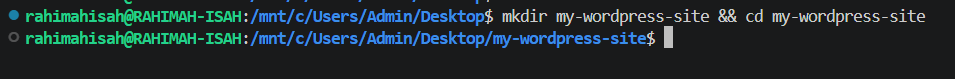
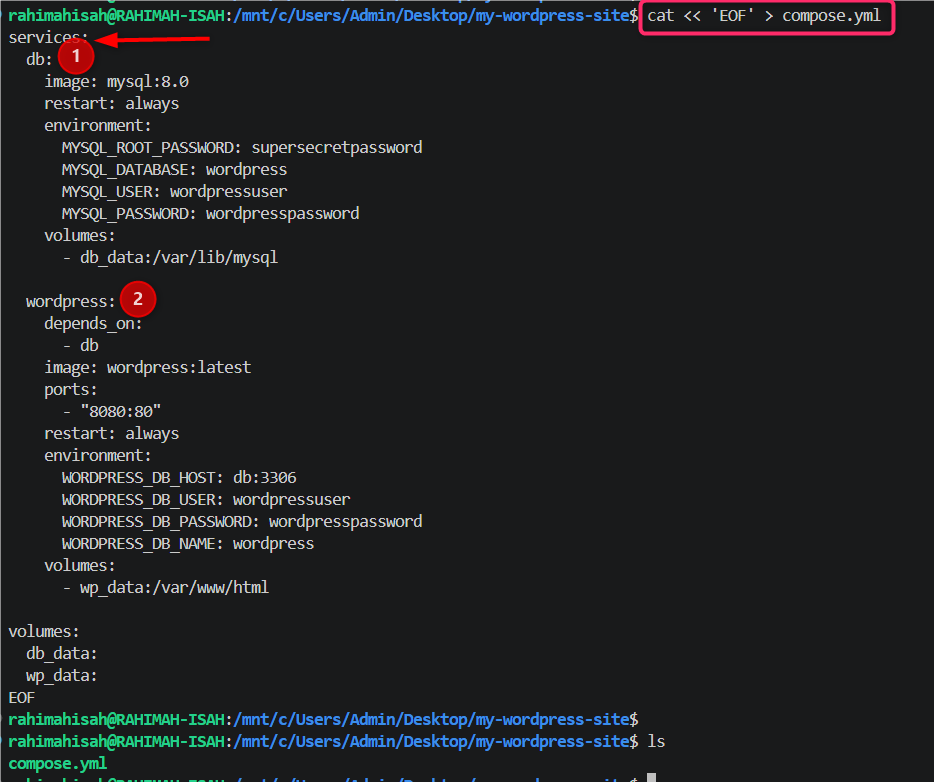
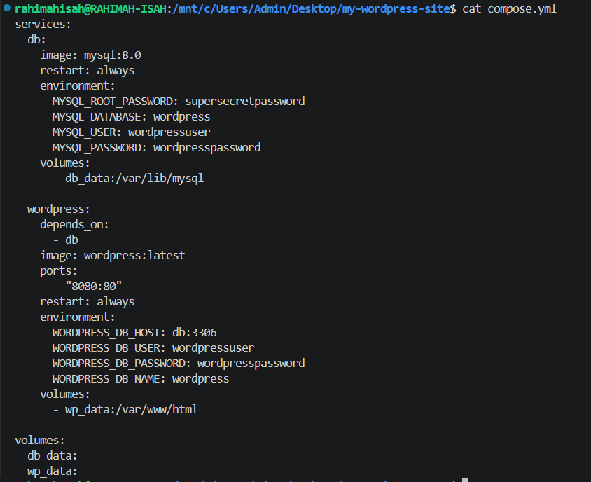
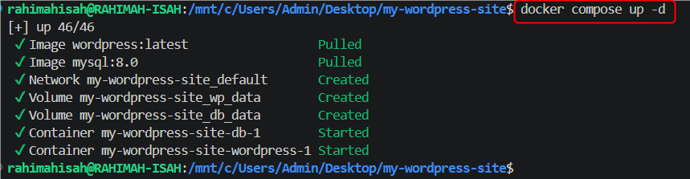
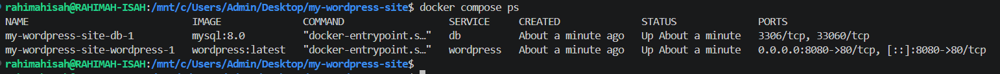
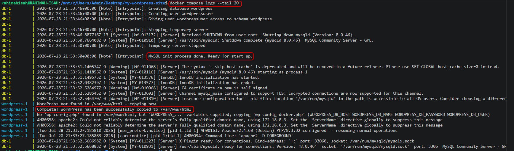
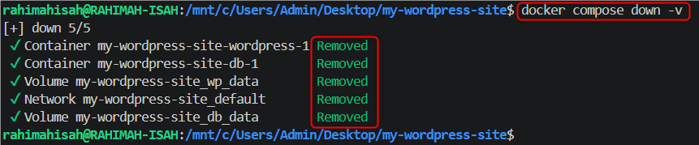
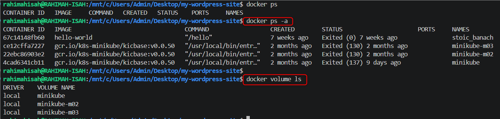

# Docker Compose WordPress Lab


## Project Overview

This project demonstrates how to use Docker Compose to define and manage a multi-container WordPress application with a MySQL database.

The environment is configured using a `compose.yml` file, allowing both services, their networking, environment variables, and persistent volumes to be managed together.

## Project Objectives

- Understand the purpose of Docker Compose.
- Create a multi-container application using Docker Compose.
- Deploy WordPress and MySQL as separate services.
- Configure service communication using a Compose file.
- Manage persistent storage with Docker volumes.
- Verify running services and inspect container logs.
- Clean up containers, networks, and volumes using Docker Compose.

---

## Technologies Used

- Docker
- Docker Compose
- WordPress
- MySQL 8.0
- YAML
- Linux (WSL)

---

## Project Structure

```text
my-wordpress-site/
├── screenshots/
│   ├── 01-project-workspace.png
│   ├── 02-compose-file-created.png
│   ├── 03-compose-file-content.png
│   ├── 04-compose-up.png
│   ├── 05-compose-ps.png
│   ├── 06-compose-logs.png
│   ├── 07-compose-down-v.png
│   └── 08-cleanup-verification.png
├── compose.yml
└── README.md
```
## Docker Compose Configuration

The `compose.yml` file defines two services:

### 1. MySQL Database

```yaml
db:
  image: mysql:8.0
  restart: always
```

The `db` service uses the official **MySQL 8.0** image and is configured with database credentials and a persistent volume.

### 2. WordPress Application

```yaml
wordpress:
  image: wordpress:latest
  ports:
    - "8080:80"
```

The `wordpress` service uses the official WordPress image and maps port `8080` on the host to port `80` inside the container.

### Service Communication

WordPress connects to MySQL using:

```yaml
WORDPRESS_DB_HOST: db:3306
```

Here, `db` is the **Compose service name**. Docker Compose provides internal networking so the WordPress container can reach the MySQL container using that name.

### Persistent Volumes

Two named volumes are defined:

```yaml
volumes:
  db_data:
  wp_data:
```

- `db_data` stores MySQL database data.
- `wp_data` stores WordPress application data.

This allows data to persist beyond the lifecycle of individual containers.

## Implementation

### Step 1: Create the Project Workspace

The project directory was created to provide a dedicated workspace for the Docker Compose lab.

```bash
mkdir my-wordpress-site
cd my-wordpress-site
```



### Step 2: Create the Compose File

A `compose.yml` file was created to define the WordPress and MySQL services, their configuration, networking, and persistent storage.

```bash
cat << 'EOF' > compose.yml
```

The complete Compose configuration is documented in the next section.



### Step 3: Inspect the Compose File

The `cat` command was used to verify the contents of `compose.yml` before starting the services.

```bash
cat compose.yml
```



### Step 4: Start the Services

Docker Compose was used to create and start the WordPress and MySQL services in detached mode.

```bash
docker compose up -d
```

The `-d` option runs the services in the background, allowing the terminal to remain available for other commands.



### Step 5: Verify the Services

The running services were checked using:

```bash
docker compose ps
```

This confirmed the status of the WordPress and MySQL containers managed by Docker Compose.



### Step 6: Inspect Service Logs

The service logs were reviewed to check the WordPress and MySQL containers for startup messages, errors, or warnings.

```bash
docker compose logs --tail 20
```

The `--tail 20` option limits the output to the latest 20 log lines.



### Step 7: Stop and Remove the Services

After verifying the deployment, the WordPress and MySQL services were stopped and removed using:

```bash
docker compose down -v
```

The `-v` option also removes the named volumes created for the project.



### Step 8: Verify Cleanup

After running `docker compose down -v`, the containers and named volumes were verified to ensure they had been removed.

```bash
docker compose ps
docker ps -a
docker volume ls
```

The verification confirmed that the project containers and the `db_data` and `wp_data` volumes were removed.



## Key Takeaways

- Docker Compose simplifies the management of multi-container applications.
- A `compose.yml` file defines services, images, ports, environment variables, and volumes.
- Compose services can communicate using their service names.
- Named volumes provide persistent storage for containerized applications.
- `docker compose ps` helps verify service status.
- `docker compose logs` is useful for troubleshooting services.
- `docker compose down -v` removes the containers and associated named volumes.

## Skills Demonstrated

- Docker Compose
- Multi-container application deployment
- YAML configuration
- WordPress containerization
- MySQL containerization
- Docker networking and service discovery
- Docker named volumes and persistent storage
- Container lifecycle management
- Container log inspection and troubleshooting
- Docker CLI
- Linux command line
- Technical documentation with GitHub

